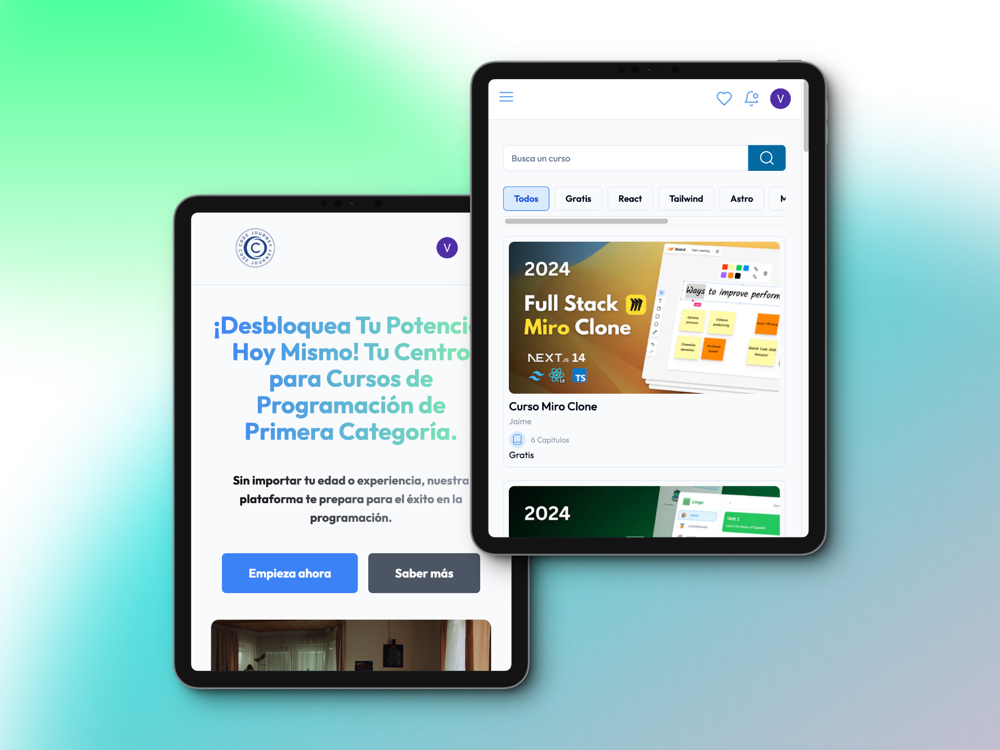
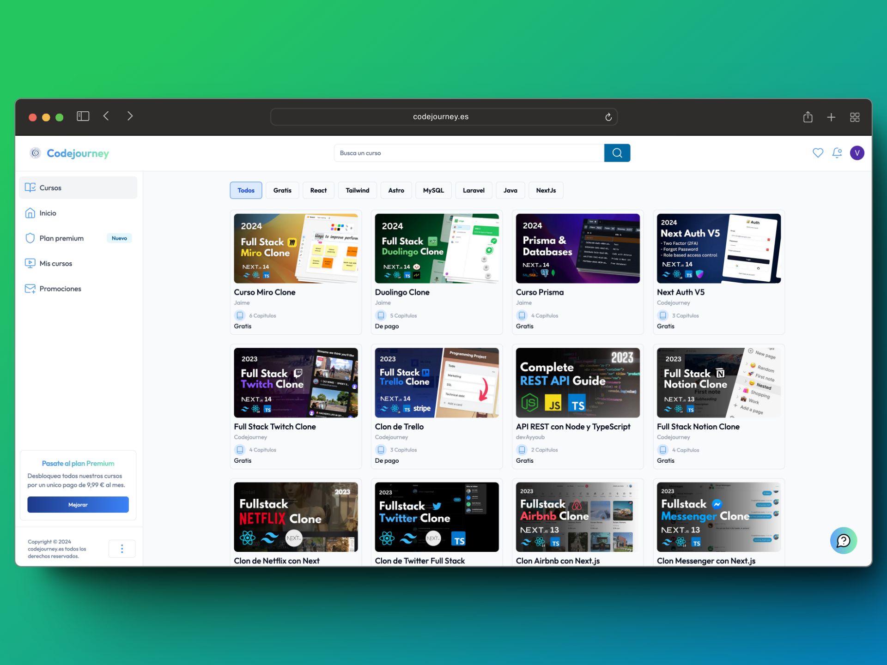
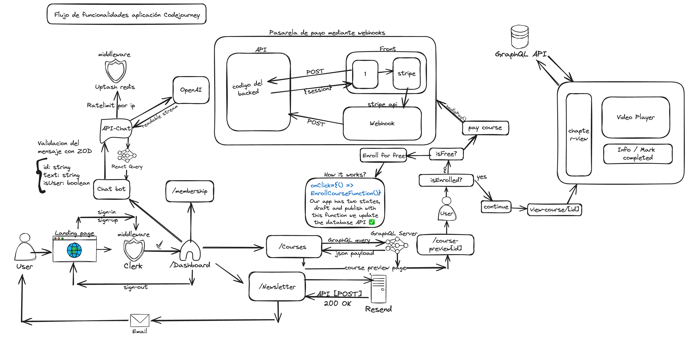

# 📌 Overview

Codejourney is a Nextjs / Tailwind web page project.
<br><br>





## 🛠️ Stack

- [Next](https://nextjs.org/): React framework for building web applications with server-side rendering.
- [Tailwindcss](https://tailwindcss.com/): CSS framework for rapid UI development.
- [Typescript](https://www.typescriptlang.org/): Strongly typed programming language that builds on JavaScript, giving you better tooling at any scale.
- [Hygraph](https://hygraph.com/): Cloud GraphQL API.
- [Shadcn](https://ui.shadcn.com/): React components library.
- [Resend](https://resend.com/): Module for Nextjs applications to allow easy email sending.
- [Shadcn](https://ui.shadcn.com/): React components library.
- [Lucide Icons](https://lucide.dev/): Icons.
- [Clerk](https://clerk.com/): Module for Nextjs applications to manager users and middleware.
- [Uptash](https://upstash.com/): Serverless Data Platform (Redis). 
- [Zod](https://zod.dev/): Schema validation with static type inference.
- [Stripe](https://stripe.com/es): Payment gateway.
- [Tanstack](https://tanstack.com/query/latest): Powerful asynchronous state management.
  
## 🚀 Run application

1. Clone the repository.
2. Create a copy of ```.env.template``` and rename it to ```.env``` and change the environment variables (API Keys etc).
3.  Create a copy of ```.env.local.template ``` and rename it to ```.env.local``` and change the environment variables (API key).
3. Install ``npm install`` dependencies.
4. Initialise the project with ```npm run dev```.

## 📁 Project Structure
```
├─ src
│  ├─ app
│  │  ├─ (auth)
│  │  │  ├─ layout.tsx
│  │  │  ├─ sign-in
│  │  │  │  └─ [[...sign-in]]
│  │  │  │     └─ page.tsx
│  │  │  └─ sign-up
│  │  │     └─ [[...sign-up]]
│  │  │        └─ page.tsx
│  │  ├─ (home)
│  │  │  ├─ (routes)
│  │  │  │  ├─ contacto
│  │  │  │  │  └─ page.tsx
│  │  │  │  ├─ course-preview
│  │  │  │  │  └─ [courseId]
│  │  │  │  │     ├─ _components
│  │  │  │  │     │  ├─ ButtonsSection.tsx
│  │  │  │  │     │  ├─ CourseDetails.tsx
│  │  │  │  │     │  ├─ EnrollmentSection.tsx
│  │  │  │  │     │  └─ VideoPlayer.tsx
│  │  │  │  │     ├─ not-found.tsx
│  │  │  │  │     └─ page.tsx
│  │  │  │  ├─ dashboard
│  │  │  │  │  ├─ _components
│  │  │  │  │  │  └─ CourseList.tsx
│  │  │  │  │  ├─ loading.tsx
│  │  │  │  │  └─ page.tsx
│  │  │  │  ├─ inscrito
│  │  │  │  │  └─ page.tsx
│  │  │  │  ├─ layout.tsx
│  │  │  │  ├─ newsletter
│  │  │  │  │  └─ page.tsx
│  │  │  │  ├─ plan-premium
│  │  │  │  │  └─ page.tsx
│  │  │  │  ├─ privacidad-generico
│  │  │  │  │  └─ page.tsx
│  │  │  │  └─ terminos-y-condiciones
│  │  │  │     └─ page.tsx
│  │  │  └─ _components
│  │  │     ├─ (Contact)
│  │  │     │  └─ ContactForm.tsx
│  │  │     ├─ (Dashboard-components)
│  │  │     │  └─ Categories.tsx
│  │  │     ├─ (Newsletter)
│  │  │     │  └─ EmailForm.tsx
│  │  │     ├─ (Side-BarNav)
│  │  │     │  ├─ Aside.tsx
│  │  │     │  ├─ FooterAside.tsx
│  │  │     │  ├─ MainEstructure.tsx
│  │  │     │  ├─ NavBar.tsx
│  │  │     │  └─ SearchBar.tsx
│  │  │     └─ index.ts
│  │  ├─ (pages)
│  │  │  ├─ codejourney-empresas
│  │  │  │  └─ page.tsx
│  │  │  ├─ layout.tsx
│  │  │  ├─ preguntas-y-respuestas
│  │  │  │  └─ page.tsx
│  │  │  └─ programas-estudio
│  │  │     ├─ _components
│  │  │     │  ├─ Categories.tsx
│  │  │     │  └─ Courses.tsx
│  │  │     └─ page.tsx
│  │  ├─ (watch-course)
│  │  │  ├─ (routes)
│  │  │  │  └─ view-course
│  │  │  │     └─ [courseId]
│  │  │  │        ├─ _components
│  │  │  │        │  ├─ ChapterNavigation.tsx
│  │  │  │        │  └─ VideoPlayer.tsx
│  │  │  │        └─ page.tsx
│  │  │  └─ layout.tsx
│  │  ├─ _microservices
│  │  │  └─ index.tsx
│  │  ├─ api
│  │  │  ├─ checkout
│  │  │  │  └─ route.ts
│  │  │  ├─ message
│  │  │  │  └─ route.ts
│  │  │  ├─ sendContact
│  │  │  │  └─ route.ts
│  │  │  └─ sendNewsletter
│  │  │     └─ route.ts
│  │  ├─ favicon.ico
│  │  ├─ globals.css
│  │  ├─ layout.tsx
│  │  ├─ not-found.tsx
│  │  └─ page.tsx
│  ├─ components
│  │  ├─ (section-landing-pages)
│  │  │  ├─ first-section
│  │  │  │  └─ FirstSection.tsx
│  │  │  └─ second-section
│  │  │     └─ SecondSection.tsx
│  │  ├─ Chat
│  │  │  ├─ Chat.tsx
│  │  │  ├─ ChatHeader.tsx
│  │  │  ├─ ChatInput.tsx
│  │  │  ├─ ChatMessages.tsx
│  │  │  ├─ MarkdownLite.tsx
│  │  │  └─ Providers.tsx
│  │  ├─ carousel.tsx
│  │  ├─ cursos.tsx
│  │  ├─ email-template.tsx
│  │  ├─ footer
│  │  │  └─ Footer.tsx
│  │  ├─ index.ts
│  │  ├─ integrantes.tsx
│  │  ├─ not-found
│  │  │  └─ PageNotFound.tsx
│  │  ├─ top-menu
│  │  │  ├─ TopMenu.tsx
│  │  │  ├─ logo.tsx
│  │  │  ├─ manage-account-button.tsx
│  │  │  ├─ navigation-bar.tsx
│  │  │  └─ righ-side-buttons.tsx
│  │  └─ ui
│  │     ├─ accordion.tsx
│  │     ├─ button.tsx
│  │     ├─ card.tsx
│  │     ├─ carousel.tsx
│  │     ├─ dropdown-menu.tsx
│  │     ├─ form.tsx
│  │     ├─ input.tsx
│  │     ├─ label.tsx
│  │     ├─ navigation-menu.tsx
│  │     ├─ select.tsx
│  │     ├─ sheet.tsx
│  │     ├─ tabs.tsx
│  │     ├─ textarea.tsx
│  │     ├─ toast.tsx
│  │     ├─ toaster.tsx
│  │     ├─ typewriter-effect.tsx
│  │     └─ use-toast.ts
```

## 📐 Excalidraw




